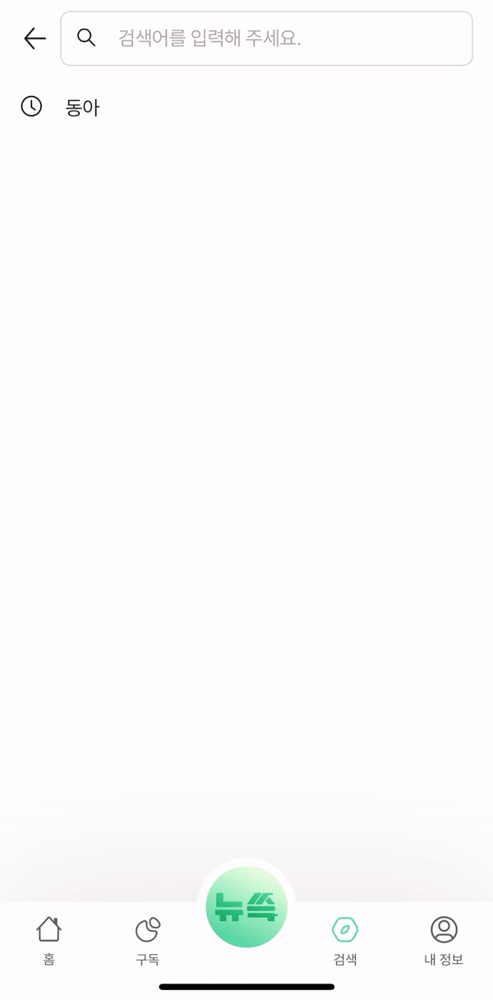

# 📰 뉴쓱 

**뉴쓱 서비스**는 사람들이 뉴스를 더 쉽고 재밌게 소비할 수 있도록 뉴스를 숏폼 형태로 제공하는 커뮤니티 플랫폼입니다.

사용자들은 간단한 숏폼 영상으로 최신 뉴스를 빠르게 확인하고, 접근성을 높인 인터페이스를 통해 다양한 뉴스를 소비할 수 있습니다.

<!--  -->

---

## 💻 프로젝트 주요 기능

### 🎬**뉴스 숏폼**

- **오늘의 기사**: 오늘 발행된 최신 뉴스를 숏폼 영상으로 제공하여 사용자들이 최신 뉴스를 빠르게 확인할 수 있습니다.
- **나이대 별 추천 기사**: 사용자의 연령대에 맞춰 가장 많이 조회된 뉴스를 추천해 주며, 연령대별로 적합한 콘텐츠를 제공합니다.
- **전체 기사**: 전체 뉴스 기사를 숏폼 리스트로 확인할 수 있으며, 카테고리 필터를 통해 정치, 경제 등 원하는 분류의 기사를 쉽게 탐색할 수 있습니다.

<!--  -->

### 💼 **언론사 구독 기능**

- 사용자가 관심 있는 언론사를 구독하여 해당 언론사의 기사 숏폼을 모아볼 수 있는 구독 기능을 제공합니다.

### 📂 **기사 스크랩 기능**

- 사용자가 보고 싶은 기사를 스크랩할 수 있는 기능으로, '저장하기' 버튼을 눌러 자신이 만든 폴더에 숏폼 영상을 저장할 수 있습니다. 
- 저장된 기사는 언제든지 쉽게 다시 확인할 수 있습니다.

### 🔍 **검색 기능**

- 키워드를 입력하면 관련된 기사와 언론사를 제공합니다.

### 🎯 **맞춤형 기사 제공 기능**

- 사용자의 시청 기록을 바탕으로 가장 많이 시청한 카테고리에 맞는 기사를 제공합니다.
- 

---

## 🧑🏻 팀원

### Client
|김주연|김민경|오화랑|
| :-: | :-: | :-: |
 |  |  |
|[izodam](https://github.com/izodam)|[Hwarang-Oh](https://github.com/mkkim68)|[mimiminz](https://github.com/Hwarang-Oh)|

### Server
|박근석|박상후|박찬규|
| :-: | :-: | :-: |
 |  |  |
[parkrootseok](https://github.com/parkrootseok)|[SangHuPark](https://github.com/SangHuPark)|[pcg0610](https://github.com/pcg0610)

## ⚒️ 기술 스택

## 🖥️ Client
|역할|종류|
|:-|:-|
|Framework|	 |
|Programming Language|  |
|Styling| |
|State Management|  |
|Version Control|	  |
|IDE|  |

## 🖥️ Server
|역할|종류|
|:-|:-|
|Framework|	 
|Programming Language| |
|Database|     |
|Cloud|   | 
|DevOps|  | | 
|Version Control|	  |
|IDE|  

## 🖥️ Data
|역할|종류|
|:-|:-|
|Framework|	 
|Programming Language| |
|Cloud|  | 
|DevOps|  | | 
|Version Control|	  |

## 🖥️ Common
|역할|종류|
|:-|:-|
|Collaboration|   |
