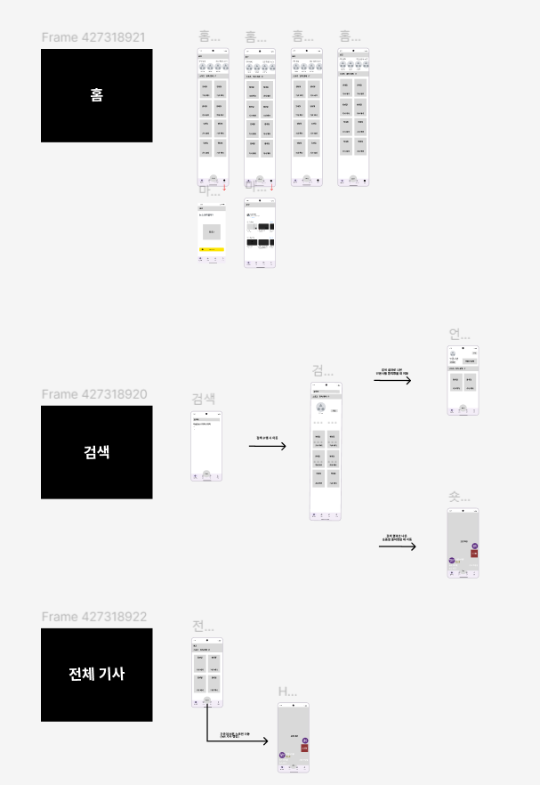

## 08/26

### 아이디어 회의

#### 사용자가 읽은 기사에 대한 숏폼 제작

1. 주제 적합성: 중
   - 사용자는 기사를 읽기만 하면 이를 요약한 숏폼 형태로 제공받아 쉽게 재열람, 공유할 수 있다.
2. 개발 난이도: 중
   - 텍스트 추출 및 요약 AI + 생성형 AI 의 조합
3. 창의성: 상
   - 최근 사람들이 숏폼 형태의 컨텐츠를 주로 소비한다는 점을 자극해 뉴스와 이어주는 것이 창의적이라 생각

#### 사용자가 촬영한 식물 이미지를 받아 상태를 파악하고 이에 따른 관리를 제공

1. 주제 적합성: 상
   - 이미지를 통해 식물의 종을 파악하고, 해당 식물의 상태를 판단하고 그 상태에 필요한 관리를 제공
2. 개발 난이도: 하
   - 유의미한 데이터도 있고 시중의 객체 인식 모델이 잘 되어 있어 혼란이 적을 것 같음
3. 창의성: 중
   - 사용자가 매번 사진을 찍어 본인의 식물을 점검해야 한다는 것에서 창의성이 떨어지는 것 같음
   - UI/UX 적으로 창의성을 풀어주어야 한다고 생각

#### 유적지, 문화재와 연관된 역사 정보 제공

1. 주제 적합성: 상
   - 사용자가 촬영한 사진의 문화재를 판단하고 해당 문화재의 특징적인 정보를 보관 & 제공할 수 있어야 함
2. 개발 난이도: 상
   - 정확도를 높이기 위해 문화재 간 유사성을 구별할 수 있어야 함
   - 일회성 서비스로 그치지 않으려면 문화재에 가기 전 그 문화재에 갈 만한 욕구를 심어줄 서비스 만의 스토리가 필요함
3. 창의성: 중

## 08/27

### 컨설턴트 미팅

#### 식물 관리

기대하는 방향은 IOT 쪽으로 생각하셔서, 모든 식물에 대한 컨트롤을 담당해주는 느낌인 것 같음

⇒ 별다른 말씀은 없으심

⇒ 식물은 많이 보았음 ( 파충류에 대한 프로젝트도 있었음 )

⇒ 흔해도, **밸런스가 좋다는 것에 대한 것은 부정하지 않음**

⇒ 좋은 카메라를 통해, 어떻게 찍으면 좋을 지에 대한 안내도 들어가야 할 것 같음 ( 천장에 달아두는 카메라 형태 추천 )

⇒ Client 쪽이나 BackEnd 쪽이나 고점으로 간다면, 할 것 많을 수도 있다.

#### 기사 숏폼

⇒ 단순한 내용의 요약이 아닌, 기사의 전체적인 흐름과 어려운 용어에 대한 해설, 스토리 라인으로 기사 숏폼을 만들어 낸다. ( 생성형 )

⇒ 실제의 결과물에 대해 궁금해 하심 ( 결과물이 괜찮으면, 나쁘지 않아 하심 )

⇒ 잘된다면 서비스 적으로 재밌겠다

⇒ but **개발적으로는 잘 모르겠다 한계가 있으니**

## 08/28

### 아이디어 회의

#### 그림 일기

- 꿈을 적으면 그 꿈을 해석해주고, 해석을 바탕으로 꿈의 내용을 그림으로 표현.
- 차별성을 주기 위하여 꿈을 공유하는 방안이 나옴

#### 고양이 도감

- 동네 길고양이를 사진을 찍어 우리 동네 길고양이 도감을 만들기
- 사진을 찍으면 이미 전체 도감에 있는지 확인 후 없을 때에 내 도감에 등록
- 친밀도를 유지해야 내 도감에 해당 길고양이가 있음
- 비슷하게 생긴 고양이를 어떻게 구분할 지가 고민

## 08/30

### 아이디어 구체화

#### 뉴스 기사 숏폼 제작

- 크롤링 후 요약 -> 이미지&대본 제작 -> 비디오 제작
- 웹앱(PWA)

## 09/02

### 와이어프레임

## 09/03

### 디자인/기획

- 어디에 ai 모델을 넣을 것인가?

1. 사진 분석 후 기사 추천
2. 기자가 사진 올리면 사진 분석 후 초안 작성

## 09/04

### 디자인

## 09/06

### 기능명세서 작성
