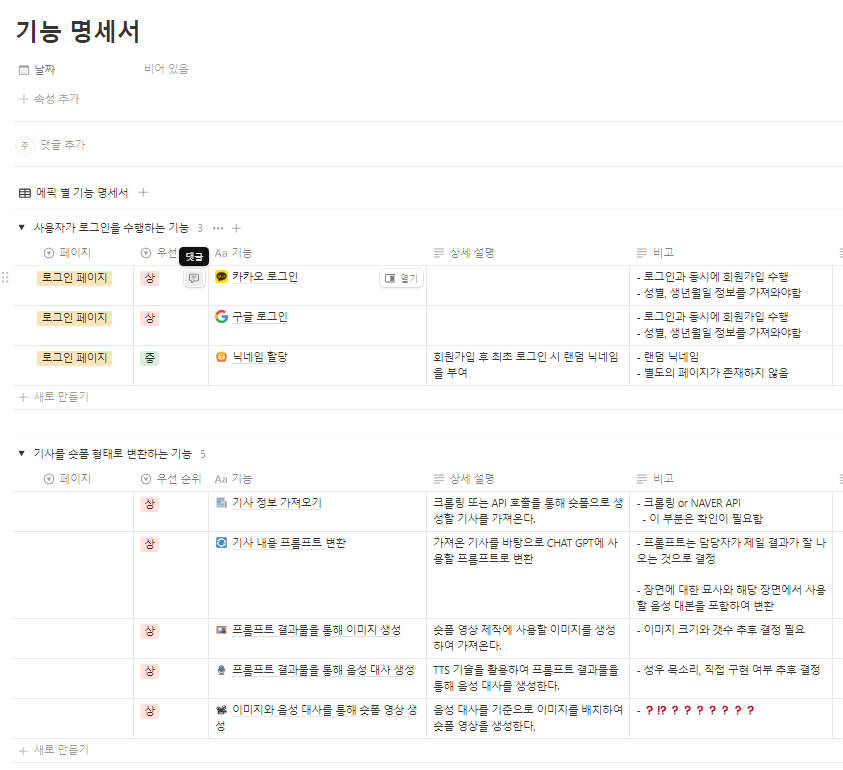
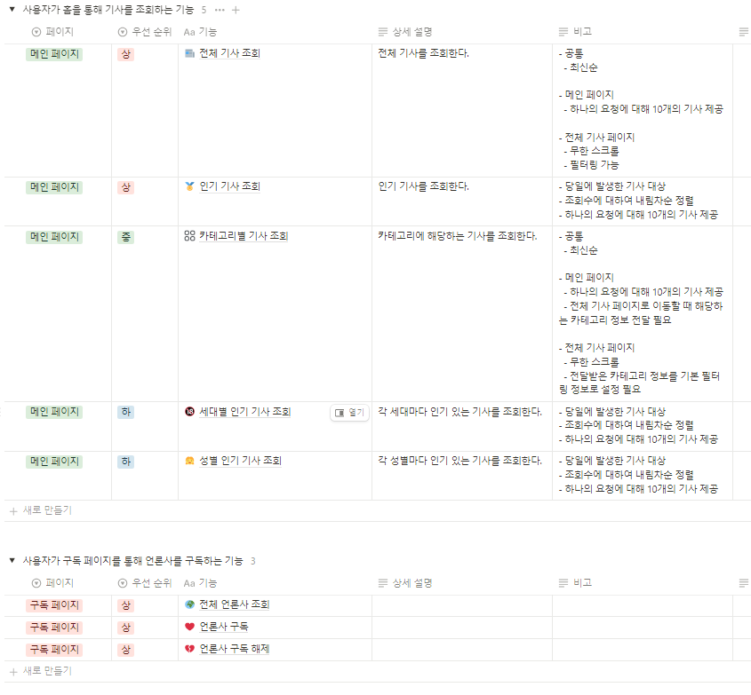
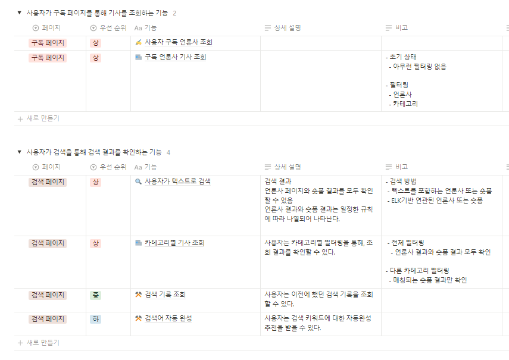
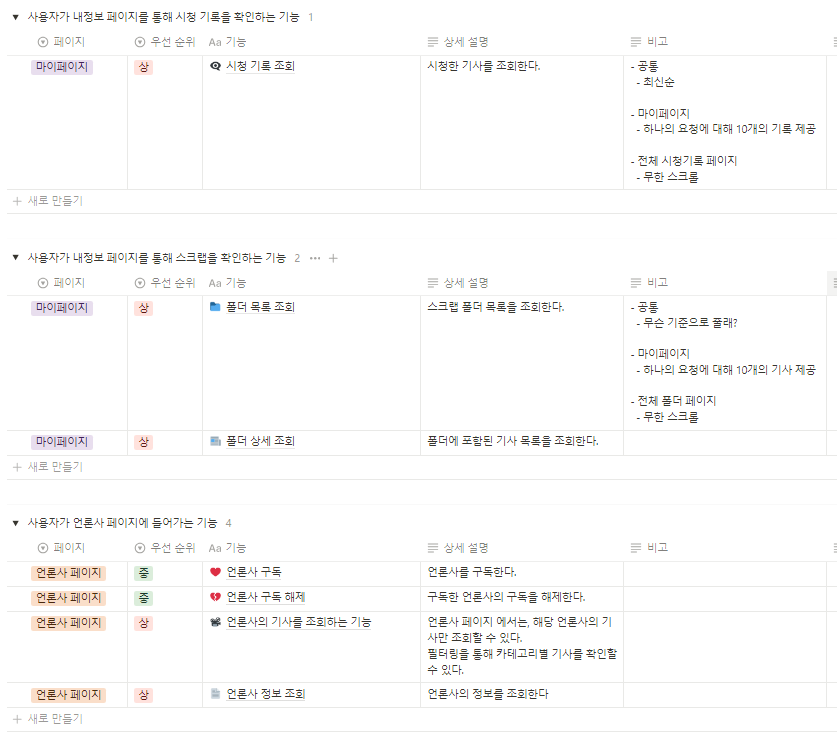
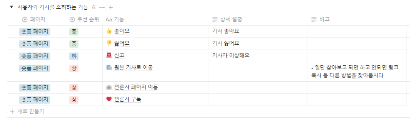

## 08/26

### 아이디어 회의

#### 사용자가 읽은 기사에 대한 숏폼 제작

1. 주제 적합성: 중
   - 사용자는 기사를 읽기만 하면 이를 요약한 숏폼 형태로 제공받아 쉽게 재열람, 공유할 수 있다.
2. 개발 난이도: 중
   - 텍스트 추출 및 요약 AI + 생성형 AI 의 조합
3. 창의성: 상
   - 최근 사람들이 숏폼 형태의 컨텐츠를 주로 소비한다는 점을 자극해 뉴스와 이어주는 것이 창의적이라 생각

#### 사용자가 촬영한 식물 이미지를 받아 상태를 파악하고 이에 따른 관리를 제공

1. 주제 적합성: 상
   - 이미지를 통해 식물의 종을 파악하고, 해당 식물의 상태를 판단하고 그 상태에 필요한 관리를 제공
2. 개발 난이도: 하
   - 유의미한 데이터도 있고 시중의 객체 인식 모델이 잘 되어 있어 혼란이 적을 것 같음
3. 창의성: 중
   - 사용자가 매번 사진을 찍어 본인의 식물을 점검해야 한다는 것에서 창의성이 떨어지는 것 같음
   - UI/UX 적으로 창의성을 풀어주어야 한다고 생각

#### 유적지, 문화재와 연관된 역사 정보 제공

1. 주제 적합성: 상
   - 사용자가 촬영한 사진의 문화재를 판단하고 해당 문화재의 특징적인 정보를 보관 & 제공할 수 있어야 함
2. 개발 난이도: 상
   - 정확도를 높이기 위해 문화재 간 유사성을 구별할 수 있어야 함
   - 일회성 서비스로 그치지 않으려면 문화재에 가기 전 그 문화재에 갈 만한 욕구를 심어줄 서비스 만의 스토리가 필요함
3. 창의성: 중

## 08/27

### 컨설턴트 미팅

#### 식물 관리

기대하는 방향은 IOT 쪽으로 생각하셔서, 모든 식물에 대한 컨트롤을 담당해주는 느낌인 것 같음

⇒ 별다른 말씀은 없으심

⇒ 식물은 많이 보았음 ( 파충류에 대한 프로젝트도 있었음 )

⇒ 흔해도, **밸런스가 좋다는 것에 대한 것은 부정하지 않음**

⇒ 좋은 카메라를 통해, 어떻게 찍으면 좋을 지에 대한 안내도 들어가야 할 것 같음 ( 천장에 달아두는 카메라 형태 추천 )

⇒ Client 쪽이나 BackEnd 쪽이나 고점으로 간다면, 할 것 많을 수도 있다.

#### 기사 숏폼

⇒ 단순한 내용의 요약이 아닌, 기사의 전체적인 흐름과 어려운 용어에 대한 해설, 스토리 라인으로 기사 숏폼을 만들어 낸다. ( 생성형 )

⇒ 실제의 결과물에 대해 궁금해 하심 ( 결과물이 괜찮으면, 나쁘지 않아 하심 )

⇒ 잘된다면 서비스 적으로 재밌겠다

⇒ but **개발적으로는 잘 모르겠다 한계가 있으니**

## 08/28

### 아이디어 회의

#### 그림 일기

- 꿈을 적으면 그 꿈을 해석해주고, 해석을 바탕으로 꿈의 내용을 그림으로 표현.
- 차별성을 주기 위하여 꿈을 공유하는 방안이 나옴

#### 고양이 도감

- 동네 길고양이를 사진을 찍어 우리 동네 길고양이 도감을 만들기
- 사진을 찍으면 이미 전체 도감에 있는지 확인 후 없을 때에 내 도감에 등록
- 친밀도를 유지해야 내 도감에 해당 길고양이가 있음
- 비슷하게 생긴 고양이를 어떻게 구분할 지가 고민

## 08/29
### 뉴스기사 숏폼 Maker → 기업 정보 / 일반 정보 숏폼 Maker

- 고민 : 텍스트로 동영상을 만들어 내는 것이 큰 어려움이 있을 것 같다.

⇒ 이미지를 이어붙이는 형태에서 더 발전시켜봄.

⇒ 취업 준비생, 학생들을 위해 어느정도 정리한 노트를 카드뉴스 형태로 만들어 주는 것은 어떨까?

⇒ 익스텐션이 사용자가 확인하는 기업 정보에 대한 Tab 창의 내용을 확인함

⇒ 분석이 완료되면, 결과물을 사용자에게 제공해준다. 

**Problem )** 

⇒ 사용자는 불필요한 Tab도 확인할 것인데, 이것을 구분해서 할 것인가?

⇒ 기업에 대한 키워드가 들어가야지, 익스텐션이 이를 구분해서 정보를 분석할 수 있지 않을까?

- 브라우저에서 여러 Tab을 바탕으로 Text를 어느 정도 정제해서, 입력으로 던져서 카드 뉴스를 만들어 줄 텐데 → 꽤나 어려운 절차를 거쳐가야 할 것 같다.

⇒ 글을 추출하는 과정부터 일단, 매우 어렵게 생각되고 많은 시간을 쏟아야 할 것이다.

⇒ 이것을 기반으로 요약을 하고, 요약 내용을 기반으로 추가적인 컨텐츠를 생성해야 하는 과정도 있음 ( 높은 리스크 )

⇒ Document를 파싱하는 경험도 있고 Chrome Extension을 경험해본 사람이 어느 정도 있어야 할 것 같다고 생각된다.

⇒ 그냥 Volume을 더 낮춰서, 단순하게 기업 네이밍을 기반으로 텍스트를 추출하는 것도 훌륭할 것 같다. 

- 기업분석으로 들어간다면, 텍스트가 더 많이 중요할 텐데 어떻게 이미지를 만들어 준다는 것인가?
    
    ⇒ 중요한 내용이 담긴 이미지에, Caption이 담긴 정보가 제공될 것 같다. 
    

- 꼭 숏폼으로 나와야 정보의 전달력이 향상된다고 볼 수 있을까? ⇒ 텍스트가 더 좋을 수 있는 상황도 생각을 해야 할 것이다.

### 방향성을 바꿔서, 일반 대학생 기반의 숏폼 카드뉴스

- 동영상 기반으로 숏폼이 생성되지 않는 상황에 대한 대안

⇒ 대학생들이 정리된 노트를 기반으로, 이미지의 카드뉴스를 만들어서 간단한 시각적 단권화를 돕는다.

⇒ 우리의 의견으로는, 단순하게 그들의 노트 내용을 정리해서 카드뉴스를 만들어내는 것은 너무 볼륨이 작을 것이라고 생각해서, 종합 노트 앱으로 발전시켜나가야 한다고 생각함

⇒ 하지만, 노트 앱으로 가면 문서 필기까지 다뤄야 할 것 같은데 문제가 많을 것 같음.

**Problem )**

⇒ 이에 대해 상용적으로 운용하고 있는 소프트웨어가 존재하는가? ( 이미지는 있음 )

⇒ 왜 동영상으로 하지 않을까? ( 그들은 그것만 하는 사람들인데, 안되니까 만들지 않는게 아닐까? )

Recommend )

⇒ 꼭 발화하는 화자의 목소리만 담겨야 할까? 쉽게 이해할 수 있다면 입력 폼에 PDF 강의자료를 넣어서 더 많은 데이터를 제공해서 퀄리티 있는 정보를 생성하도록 하는 것이 좋지 않을까? 

⇒ **생각을 해보자, 재미없는 주제를 최대한 재미있게 숏폼을 만들어주는 것이 어떻게 안좋을 수가 있겠는가?** 

### 공통 Problem )

⇒ 근본적인 문제는, 숏폼이 정확하게 어떻게 나와야 하는 것인가?

⇒ **이미지와 삽화는 생성형 AI**로 만들어낼 것이고, **음성 데이터를 기반으로 요약을 해서 내용**을 구성할 것. ( 내용을 요약을 해주는 것은 꽤나 의미있게 나올 것 이다. )

⇒ 이미지를 제대로 만들어 낼 수 있는 지, 이를 검증하는 것도 필요하다.

⇒ 숏폼으로 생성되고, 노트 필기본 ( 단권화본 )이 완성되는 과정에서, 드시는 생각은 Client단이 죽어날 것 같다. 

<aside>
💡 **어떻게  Image의 화풍과 내용 Context가 일관되게 유지할 수 있을 것인가?**

</aside>

### 공통 추천 )

⇒ 긴 뉴스 기사 혹은 사회의 현황을 단 1장의 사진으로 풍자스럽게 표현하는 삽화작가처럼

⇒ 딱 1장의 사진이라도 제대로 만들어낼 수 있다면, 큰 의미가 있다고 생각한다.

**⇒ 그냥 얼른 Test를 해보자!!!!!**


## 08/30
### 아이디어 구체화


# 사용자

## 로그인

### 소셜 로그인

- 카카오 (확정)
- 구글(성별, 나이 받아올 수 있는지 확인 필요)

## 회원가입

- 닉네임을 랜덤으로 생성하여 부여
    - 1회 닉네임 생성 재요청 허용
- 선호하는 언론사 선택하기
    - 건너뛰기 가능

## 언론사 구독

- 메인 페이지에서 언론사 리스트 조회가 필요
    - 이를 통해 언론사 구독을 유도함
- 조선, 중앙, 동아, MBC, KBS, SBS, YTN

## 마이페이지

### 스크랩 기사를 조회하는 기능

- 사용자가 스크랩한 기사를 보여줌
- 폴더링을 통해 스크랩한 기사를 관리
    - 기본 폴더가 존재하고, 필요한 폴더는 생성

### 구독한 언론사를 관리하는 기능

### 내가 본 기사를 확인하는 기능

# 숏폼 기사

## 생성

### 크롤링을 통해 기사를 가져오는 기능

- 1안 : 언론사 홈페이지에서 직접 크롤링
- 2안 : 네이버 API
- 기사의 제목, 본문, 사진만 추출

### 기사에 대한 내용을 필요한 형태의 데이터로 변환하는 기능

- 기사 내용을 요약
- 영화 시나리오 형태로 변환

### 정제한 데이터를 바탕으로 기사를 사진 형태로 변환하는 기능

### 정제한 데이터를 바탕으로 대사(음성 데이터)를 생성하는 기능

### 숏폼 형태의 동영상과 대사(음성 데이터)를 결합하는 기능

## 조회

### 검색 기능

- 엘라스틱 서치를 활용해보자

### 모든 기사를 조회할 수 있는 기능

- 필터
    - 대분류
        - 카테고리별 조회
        - 언론사별 조회

### 구독한 언론사의 기사만 조회할 수 있는 기능

## 부가 기능

### 기사를 스크랩하는 기능

- 기본 폴더에 우선 저장 후 관리 페이지에서 폴더링

### 시청한 숏폼에 대한 정확도를 평가(신고)하는 기능

- 도움 여부에 대해 측정하여 이를 통해 숏폼 영상 재생성

# 09/02
## WireFrame 고려 사항 정리

### 1. 검색 결과

1. 언론사에 대한 우리가 추가적인 컨텐츠를 추가할 수 는 없고, 형식만 맞출 것이라면 언론사에 대한 검색 정보를 추가할 필요가 있을까?
    
    ⇒ 우리는 숏폼을 강점으로 가야 하는데, 언론사를 많이 고려할 필요는 없을 것 같다.
    
    ⇒ 이렇게 간다면, Home 화면에서 구독 언론사의 필터링이 필요해져야 할까? ( 검색창을 넘어서 )
    

**추가적인 Problem )**

→ 여러 언론사에서 나오는 같은 내용으로 나오는 것을 묶어야 하는 필수가 생김 ( 언론사를 구분하지 않기 때문에 )

**결론 → 검색 결과에 언론사 정보도 띄워주고, 숏폼의 형식을 강화하기 위해서 추천 서비스도 들어가자**

### 2. 언론사 검색과 언론사 필터링이 함께 있어야 할까? ( 전체 )

⇒ 언론사에 대한 정보가, 우리 서비스에 그렇게 큰 부분을 차지하지 않는다.

⇒ 언론사에 대한 구독 정보와, 구독을 통해 할 수 있는 것들을 Modal 혹은 다른 View로 넘어갈 수 있는 “모든 언론사 보기”와 같은 Navi가 들어가게 한다.

### **3. MyPage로 향하는 Navi는 어떻게 설정할 것인가? ( 중요 )**

1. 만약 햄버거로 한다면, 어떤 정보들을 Modal로 띄워줄 것인가?
2. 프로필 사진으로 할까?
3. MyPage를 하단 NavBar로 빼낼까? 

⇒ 검색란을 깔끔하게 정리하고, 아래 NavBar에 MyPage를 추가했음 ⇒ 모든 설정 / MyPage를 다룸

# 09/03
컨설턴트 회의

### 1. 국내 언론사로 할까? 해외 언론사로 진행을 할까? ( 기획의 관점 )

**Problem )** 국내 언론사는 같은 기사에 대해서, 언론사에 의한 논조의 차이도 존재함.

⇒ 이러한 논조를 제대로 숏폼 기사로 제대로 반영을 할 수 있을까? 

⇒ 논조를 제대로 반영하지 못하고, 언론사의 기사의 작성 이유를 희석시킬 우려가 있다. ( 물론 이러한 효과에 대한 가치 판단의 여부는 아직은 불가능한 상태 )

⇒ 국내 언론사들은 이미, 자체적으로 숏폼 형태의 뉴스를 제작중이긴 하다. 

⇒ 이것을 숏폼을 만들고 있는 언론사보다 우리가 경쟁력을 챙길 수 있을까? 라는 우려가 있음

**Recommend)** 

⇒ 우리는 이러한 문제점을 해외 기사를 요약하는 숏폼 방식으로 해결하려고 했다. 

⇒ 해외 기사를 통해 정보’만’을 얻으려고 하기 위한 사용자들을 위한 숏폼을 만들어낸 방식을 생각해냄. 

⇒ 해외 기사의 ‘논조’보다는 스탠다드한 ‘정보’에 맞춘 작업을 하는 것이 좋은 방향으로 보였음.

**Consultant)**

→ 그 우려는 이해를 하겠지만, 정말 해외 기사를 주기적으로 챙겨보는 사람이 있을까?

→ 국내 신문을 보는 사람은 많지만, 해외 신문을 볼 일은 별로 없는 상황이다. 

→ 해외 기사들은 숏폼을 제작하고 있지 않는가? ( 그런 일이 있어도, 국내 사용자들의 접근성이 뛰어나지 않음 )

→ 해외 기사들에 대한 소비가 아예 없지는 않으니, 이러한 근거를 바탕으로 하는 것인지 물어보심

→ 되도록 많은 사람들이 쓰고, 노출될 수 있는 서비스를 만들어내는 것이 1 목표라고 생각하심.

⇒ 이러한 이유로, 글로벌화 해서 우리나라 사람들에 국한되지 않은 글로벌 서비스를 목표로 하는 방향의 기획을 짜는 것도 좋다고는 하심

⇒ 우리 기획의 Solution을 높게 보던 시기가 있었음 → 정치색이 드러나는 기사에 대한 필터링이 들어가는 필요했음 ( 필터링이 들어가지 않으면, 정치색이 드러날 우려가 있음 )

**⇒ 민감한 부분만 내리고, 다른 부분들을 부각해서 정치에 대한 고려를 하지 않고 정말 뉴스 기사의 숏폼 제작에 목표를 해서 “한국 기사”로 가는 것을 좋다고 느끼시는 것 같음.** 

- 이미 언론사는 사람을 통해서, 직접 영상 편집을 통해서 영상을 만들어내고 있다. 이렇게 항상 비용을 들이는 과정을 우리가 개선할 수 있다면 의미가 아예 없지는 않을 것 같다.
- 뭔가 가닥만 나오면, 경쟁력에서 크게 우려할 부분은 아닌 것 같다. 애니메이션 삽화도 예전에는 사람들이 모두 그렸지만, 지금은 AI를 활용하듯이… 이런 미래 지향적인 부분에서 충분히 내세울 만한 것이 있을 것 같은 기획이라고 생각하시는 것 같음. /

-> 추천 서비스?

⇒ Consultant : 추천 서비스의 가닥이라도 잡아가면, 나쁘지 않다고 생각은 하신다. 기본적으로 추천이 들어가면 꽤나 볼륨이 크긴 하다. ⇒ 꽤나 어려운 기술이고, 데이터셋이 매우 크게 필요할 것이다. ( 최소 몇십만건?! )


# 09/04
전문가 멘토링 
### 이미지의 일관성을 유지하는 방법

**Fine Tuning** : 어떤 텍스트 혹은 이미지가 들어왔을 때 , 특정 결과로 나오게 supervised 시켜야 함.

⇒ 이미지 생성하는 것에 대한 정답 정보를 줘서 파인튜닝을 할 수 있도록 하거나

→ 프롬프트 기반의 모델을 사용할 경우 그 자체를 제대로 설정해서 균일한 영상 혹은 이미지를 만들도록 할 수 있도록 하는 것이 그나마 가장 나은 조언이 될 것 같다.

⇒ 일단 여러가지 시도를 한번 해봐라

- 특정 모델 혹은 기술을 쓸 때마다, 그것의 장단점을 적어가면서 정리하는게 우리한테 더 도움이 될 것이다.

⇒ 그냥 정말, 얻어갈 것만 가져가려고 한다면 최종적으로 모델을 선택하는 과정의 기록이 더 중요할 수도 있다. ( 그냥 해주시고 싶어하신 말씀 )

### 참고하는 원본 기사의 이미지의 사람과 유사한 이미지를 생성할 수 있을까?

딥페이크를 사용해서, 실제 서비스까지 한다면 문제가 있음. 토이 프로젝트로 시도하는 것이라면 가치가 있을 것 같다.

⇒ 해보면서, 특정 트러뷸 슈팅 과정에서 기록을 하는 것이 좋다. 

- 이러한 딥페이크를 기반으로 한 Icon을 통해서 뭔가 기획적으로 의미가 있을 지도 생각해보는 것도 좋다,

- 한명의 얼굴을 학습해서 다양한 표정을 만들어내는 기술로 알고 있음 ( GAN )

⇒ 하지만 우리는 무작위한 인물에 대한 다양한 표정을 만들어내는 요구사항이 존재함

단순 표정을 조작하는 것을 넘어서 → 눈 코 입 하나하나에 대한 디테일한 연구사항이 진행이 되었음. ⇒ 하지만 Computing Power를 요구하기 때문에 쉽게 사용할 수 있을 지 모르겠다.

### AI 모델

AI 모델 서버 자체는 어떤 프레임워크로 만들었던 간에 일관되게 서빙할 수 있는 기술이 존재한다.

“AI 모델을 서빙할 때, 어떻게 서빙해서 나간다”와 같은 가이드 라인 ( 사내규정 )

⇒ 통일을 해놔야, 나중에 문제가 터졌을 때 쉽게 서로 서로 공유하고 배울 수 있게 하고 있음.

AI 서버는 Flask, FAST API 던 상관 없음 안에 흐름과 개념은 동일하니까 하나 깊게 파도 상관 없다

⇒ 오히려 여러개 파는게 더 힘들 수도 있다.

### Prompting

전문적으로 Prompting을 조절하는 과정

어떤 텍스트와 이미지를 던졌을 때, 어떤 정답을 만들어서 비교하는 것이 정석

⇒ 하지만, 이미지와 영상의 경우 정답을 만들어내고 비교하는 로직 조차도 어려움

⇒ 이러한 경우 기업에서는 주로 Human Testing을 진행하기도 함.

- 어떤 과정에서는 어떻게 Prompt를 해야 하는 Case를 찾아내서, 분석하고, 이런 것을 기록해두고 나중에 사용하는 것이 좋음.
- Human Science과 유사한 부분 ( 언어와 같은 결과들은 제대로 정답을 만들고 비교할 수 없음 )
    
    ⇒정말 직접 확인해야할 수도 있음.
    

MLOPS → 이렇게 정성적인 평가를 위해 Cycle을 만들어서 개발을 하는 사람들도 있음.

### Mentor Opinion

현재는 정보의 바다인데, 내가 직접 Subscribe하고 찾아내야 내가 원하는 컨텐츠를 받아낼 수 있음

⇒ 많은 대기업 IT 서비스업에서, 이러한 컨텐츠를 Curation하는 기능을 많이 개발하고자 하려고 함.

⇒ 지금 우리의 서비스도 결이 같음 ( 사람들로 하여금 컨텐츠를 쉽게 찾고 즐길 수 있도록 하게 하는 느낌의 목적이 있음 )

사람들이 어떻게 더 많이 들어오게 하고, 어떻게 더 체류하고, **락인시켜서 우리 서비스에 몰두하게 만들 수 있는 지 더 많은 생각을 하는 것도 좋을 것 같다,** 

- 각각 해당 프로젝트에서 어떤 것을 얻어갈 것인 지 고민하는 시간이 되면 좋겠다.

# 09/06






# 09/09
React Hook Form 공부
## React Hook Form

사용하기 쉬운 유효성 검사를 통해 성능이 뛰어나고 유연하며 확장 가능한 form

### register

name, onBlur, onChange, onClick, ref를 return하는 함수

```ts
function ToDoList() {
  const { register } = useForm();
  return (
    <div>
      <form>
        <input {...register("toDo")} placeholder="Write a to do" />
        <button>Add</button>
      </form>
    </div>
  );
}
```

### watch

form의 입력값을 추적할 수 있음

```ts
function ToDoList() {
  const { register, watch } = useForm();
  console.log(watch());
  return (
    <div>
      <form>
        <input {...register("toDo")} placeholder="Write a to do" />
        <button>Add</button>
      </form>
    </div>
  );
}
```

### handleSubmit

validation & submit 담당

```ts
function ToDoList() {
  const { register, handleSubmit } = useForm();
  // 데이터 유효할 때 실행할 함수
  const onValid = (data: any) => {
    console.log(data);
  };
  return (
    <div>
      <form onSubmit={handleSubmit(onValid)}>
        <input {...register("toDo")} placeholder="Write a to do" />
        <button>Add</button>
      </form>
    </div>
  );
}
```

### error 나타내기

todo input이 비어있으면 안되고, 10자 이상이여야 하는 조건이 있다면,

```ts
return (
  <form onSubmit={handleSubmit(onValid)}>
    <input
      {...register("toDo", {
        required: "Todo is required",
        minLength: { value: 10, message: "too short." },
      })}
      placeholder="Write a to do"
    />
  </form>
);
```

이런식으로 required와 minLength 설정을 설정하여 validation을 확인할 수 있다.

required 값은 boolean 혹은 message를 설정할 수 있는데, message를 설정하게 되면 해당 폼이 비어있을 때 오류 메세지로 설정한 메세지가 나타나게 된다.

```
toDo:
  message: "Todo is required"
  ref: input
  type: "required"
```

해당 메세지를 html로 띄워주고 싶다면

```ts
interface IFormData {
  toDo: string;
  email: string;
}

function ToDoList() {
  const {
    register,
    watch,
    handleSubmit,
    formState: { errors },
  } = useForm<IFormData>();
  const onValid = (data: any) => {
    console.log(data);
  };
  return (
    <div>
      <form
        style={{ display: "flex", flexDirection: "column" }}
        onSubmit={handleSubmit(onValid)}
      >
        <input
          {...register("email", {
            required: "Email is required",
            pattern: {
              value: /^[A-Za-z0-9._%+-]+@naver.com$/,
              message: "Only naver.com emails allowed",
            },
          })}
          placeholder="email"
        />
        <span>{errors?.email?.message}</span>
        <button>Add</button>
      </form>
    </div>
  );
}
```

추가 ) pattern

`/^[A-Za-z0-9._%+-]+@naver.com$/` 는 해당 값이 @naver.com의 패턴을 가지는지 확인하는 용도

### defaultValues

form 선언 시

```ts
const {} = useForm<IFormData>({
  defaultValues: {
    email: "@naver.com",
  },
});
```

으로 선언하게 된다면 email이라는 이름을 가진 input의 기본 값이 @naver.com을 가지게 된다.

### 사용자 정의 validate

#### password 확인

password와 password1이 같은 값인지 확인한 후 다르면 error를 띄워야 한다

```ts
function ToDoList() {
  const onValid = (data: IFormData) => {
    if (data.password !== data.password1) {
      setError(
        "password1",
        { message: "Password are not the same" },
        { shouldFocus: true }
      );
    }
    console.log(data);
  };
  return (
    <div>
      <form
        style={{ display: "flex", flexDirection: "column" }}
        onSubmit={handleSubmit(onValid)}
      >
        <input
          {...register("password", { required: "write here", minLength: 5 })}
          placeholder="Password"
        />
        <input
          {...register("password1", { required: "write here", minLength: 5 })}
          placeholder="Password1"
        />
        <span>{errors?.password1?.message}</span>
        <button>Add</button>
      </form>
    </div>
  );
}
```

shouldFocus를 사용하여 제출 후 에러가 뜬 input에 focus를 보내준다.

#### 문자열 포함 확인

Todo에 nico와 nick이라는 단어가 들어가면 error를 띄우고 싶다면

```ts
function ToDoList() {
  return (
    <div>
      <form
        style={{ display: "flex", flexDirection: "column" }}
        onSubmit={handleSubmit(onValid)}
      >
        <input
          {...register("toDo", {
            required: "Todo is required",
            minLength: { value: 5, message: "too short." },
            validate: {
              noNico: (value) =>
                value.includes("nico") ? "no nico allowed" : true,
              noNick: (value) =>
                value.includes("nick") ? "no nick allowed" : true,
            },
          })}
          placeholder="Write a to do"
        />
        <span>{errors?.toDo?.message}</span>
        <button>Add</button>
      </form>
    </div>
  );
}
```

validate 속성을 이용하여 설정해주면 된다.

`validate: (value) => true` 면 제출 시 항상 validate를 통과하고

`validate: (value) => false` 면 제출 시 항상 error가 뜬다.

또 true, false 대신 문자열을 적으면 false로 받아들임과 동시에 에러 메세지를 해당 문자열로 출력하게 된다.

그러므로 nico라는 단어가 포함되어 있으면 error를 띄우기 위해서는
`(value) => value.includes("nico") ? "no nico allowed" : true,` 방식으로 사용하게 되는 것이다.

또 검사해야 하는 것들이 많아질 수 있음 -> noNico로 선언 가능!
